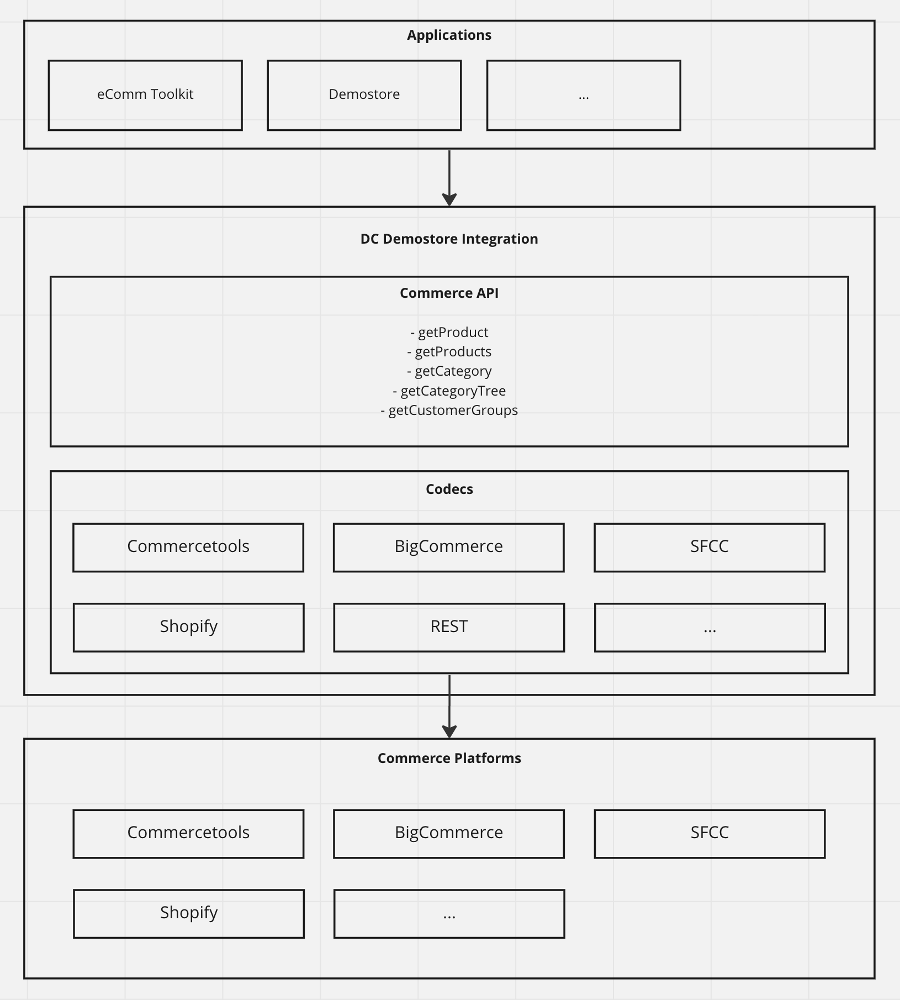

# @amplience/dc-demostore-integration

Amplience Demo Store Integration is a service written in Node.js that is intended to manage a number of different types of services, including but not limited to:

-   commerce services

dc-demostore-integration uses codecs in order to determine how and where to get data from. It currently supports getting e-commerce data from:

-   Commercetools
-   BigCommerce
-   Shopify
-   Salesforce Commerce Cloud
-   REST

## Pre-requisites

This extension was developed and tested with:

-   Node version `14.x`
-   NPM version `6.x`

## Features

The `CommerceAPI` interface exposes these methods:

-   `getProduct` (by ID or slug)
-   `getProducts` (by IDs or keyword)
-   `getCategory` (by ID or slug)
-   `getCategoryTree` (category structure)
-   `getCustomerGroups` (customer segmentation)

Concrete implementations of this interface are referred to as `Codec`s and are located in `src/codec/codecs`. Platform-specific e-commerce implementations are found in `src/codec/codecs/commerce`.
You can find types and methods [here](./commerce-codec.md).

There is a separate project called `dc-integration-tester` which provides a CLI for testing

There are also [Unit Tests](./docs/dev/unit-testing.md) for each method and vendor.

## How to use the service

As an example you can check our [eComm Toolkit extension](https://github.com/amplience/dc-extension-ecomm-toolkit) is built using dc-demostore-integration as a middleware in Next.js.

## Quick Start

Using the `config` object for one of the commerce vendors, you can get the Commerce API:

```typescript
const commerceApi = await getCommerceAPI(config)
```

From there you can use any of the commerce methods:

```typescript
// Getting the category tree
const categoryTree: Category[] = await commerceApi.getCategoryTree({})

// Getting customer groups
const customerGroups: CustomerGroup[] = await commerceApi.getCustomerGroups({})

// Getting products by ids
const products: Product[] = await commerceApi.getProducts({
    productIds: ids
})

// Getting products by keyword
const products: Product[] = await commerceApi.getProducts({
    keyword: keywordInput.current.value
})

// Getting a category by slug
const category: Category = await commerceApi.getCategory({
    slug: catSlug
})

// Getting a product by id
const product: Product = await commerceApi.getProduct({
    id: productId
})
```

## Architecture Diagram



## Vendor specific information

-   [Saleforce Commerce Cloud](./docs/vendor/sfcc.md)
-   [Shopify](./docs/vendor/shopify.md)
-   [BigCommerce](./docs/vendor/bigcommerce.md)
-   [CommerceTools](./docs/vendor/commercetools.md)
-   [REST](./docs/vendor/rest.md)

## Development

-   [Import into project](./docs/dev/import.md)
-   [Host the service](./docs/dev/host.md)
-   [Develop locally](./docs/dev/develop-locally.md)
-   [Modify an integration](./docs/dev/modify-integration.md)
-   [Add an integration](./docs/dev/add-integration.md)
-   [Unit testing guidelines](./docs/dev/unit-testing.md)

## License

This software is licensed under the [Apache License, Version 2.0](http://www.apache.org/licenses/LICENSE-2.0),

Copyright 2023 Amplience

Licensed under the Apache License, Version 2.0 (the "License"); you may not use this file except in compliance with the License. You may obtain a copy of the License at

```
http://www.apache.org/licenses/LICENSE-2.0
```

Unless required by applicable law or agreed to in writing, software distributed under the License is distributed on an "AS IS" BASIS, WITHOUT WARRANTIES OR CONDITIONS OF ANY KIND, either express or implied. See the License for the specific language governing permissions and limitations under the License.
