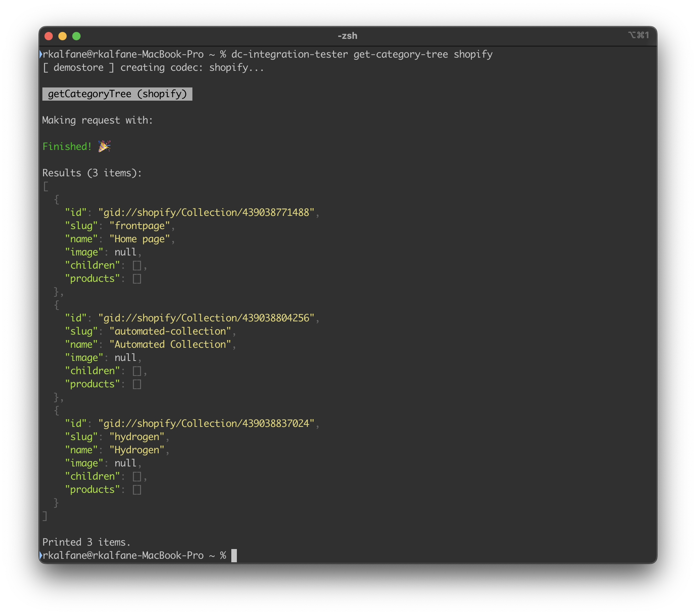

# Unit testing guidelines

This project uses unit testing to ensure correct functionality of codecs and other classes. You can run `npm run test` to run the entire test suite. Consider using a plugin for your IDE that allows you to quickly run specific jest test groups with a debugger attached, as it will greatly speed up development.

## Codecs

Codec unit testing is primarily done by mocking `axios` client responses, as all codec implementations should be using axios, and real API responses can be used as the testing data. Codec tests are mandatory for being included in the project, and need to cover any edge cases that come up.

### dc-integration-tester and responses for unit testing

If you've written a codec already, then you can check the requests being made and the responses you're getting back with the `dc-integration-tester`, a tool to let you run methods on your integration codec. Run it with the environment variable `LOG_INTEGRATION` set to `1`, and each request the codec makes will be logged, along with the response. You should pipe stdout to a file so that it's easier to search through the requests and responses. You can do that by adding `>> file.txt` to the end of the command.

You can store all your configurations in the file `<home>/.amplience/integrations.json` and quickly test using `dc-integration-tester` against any of the config:

```json
{
 . "commercetools": {
 .  . "vendor": "commercetools",
 .  . "codec_params": {
 .  .  . "project": "anyafinn",
 .  .  . "client_id": "<client id>",
 .  .  . "client_secret": "<client secret>",
 .  .  . "auth_url": "<auth url>",
 .  .  . "api_url": "<api url>",
 .  .  . "scope": "view_categories:anyafinn view_customer_groups:anyafinn view_published_products:anyafinn"
 .  . }
 . },
 . "sfcc": {
 .  . "vendor": "sfcc",
 .  . "codec_params": {
 .  .  . "api_url": "<api url>",
 .  .  . "auth_url": "<api url>",
 .  .  . "client_id": "<client id>",
 .  .  . "client_secret": "<client secret>",
 .  .  . "site_id": "<site id>"
 .  . }
 . },
 . "bigcommerce": {
 .  . "vendor": "bigcommerce",
 .  . "codec_params": {
 .  .  . "api_url": "https://api.bigcommerce.com",
 .  .  . "api_token": "<api token>",
 .  .  . "store_hash": "<store hash>"
 .  . }
 . },
 . "rest": {
 .  . "vendor": "rest",
 .  . "codec_params": {
 .  .  . "productURL": "<productURL>",
 .  .  . "categoryURL": "<categoryURL>",
 .  .  . "customerGroupURL": "<customerGroupURL>",
 .  .  . "translationsURL": "<translationsURL>"
 .  . }
 . },
 . "shopify": {
 .  . "vendor": "shopify",
 .  . "codec_params": {
 .  .  . "access_token": "<storefront access token>",
         "admin_access_token": "<admin access token>",
 .  .  . "version": "2023-01",
 .  .  . "site_id": "<site id>"
 .  . }
 . }
}
```

You can also get responses by querying the API manually, which is useful if you're focusing on tests before implementation.



### Requests, responses, results and config

To keep tests organised, API requests and responses, expected method results and codec config are always found in their own files in a `test/` folder.

- `requests.ts`: Requests that are made to axios when getting data from the API. Tests should expect the requests array from the axios mock to match their expected list of requests, in order.
- `responses.ts`: Response data that comes from the API. For responses that appear many times, it is a good idea to create parameterized generator functions. These are registered onto a mock fixture on the test, and may also be used to check 'raw' methods. Make sure to sanitize any sensitive information, and replace IDs with clear testing data.
- `results.ts`: Expected result objects and generators for data that should be returned from the codec.
- `config.ts`: Codec configuration. Make sure that no real client id, secret or other sensitive information is used on your testing config.

### Tests

All codecs should have the following tests:

- `getProduct`
  - Get a single product by ID.
- `getProducts` (multiple)
  - Get multiple products by ID. Returned data must be in the same order as the request, missing products come back as undefined.
- `getProducts` (keyword)
  - Get multiple products by keyword.
  - Should fetch more than one page of products to test pagination.
- `getProducts` (category)
  - Get multiple products by category.
  - Should fetch more than one page of products to test pagination.
- `getProduct` (missing)
  - Get a single product by ID, but the service doesn't find a match. Should return undefined.
- `getRawProducts`
  - Get a single product by ID, without any conversion from the source format. Same quirks as `getProduct`.
- `getCategory`
  - Get a category by slug. Should fully hydrate `products` array.
- `getCategoryTree`
  - Get a list of root level categories.
  - Sub-categories should be contained in children as a tree, should not appear at root level.
- `getCustomerGroups`
  - Get a list of customer groups.
  
Additional tests should be added if the vendor has any unusual behaviours that you need to test have been properly handled. If you need an example of the absolute baseline required for codec unit tests, look at the unit tests for the `rest` codec.