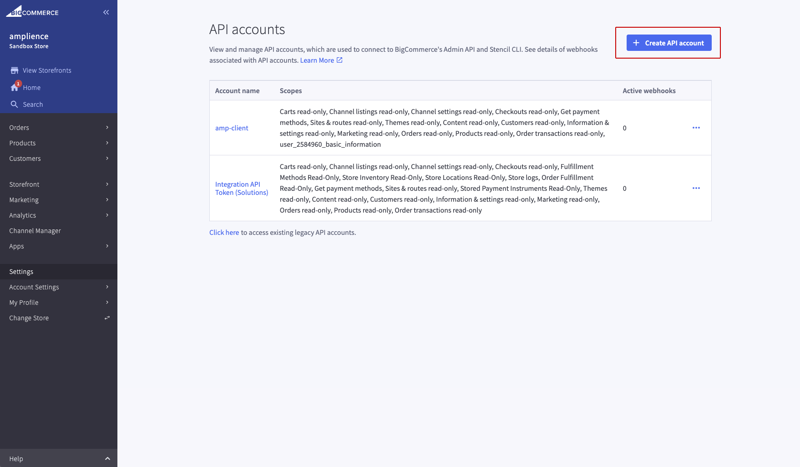
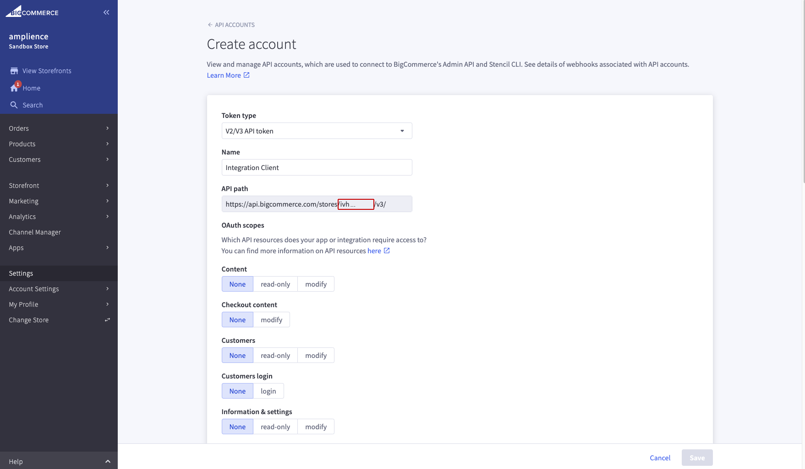
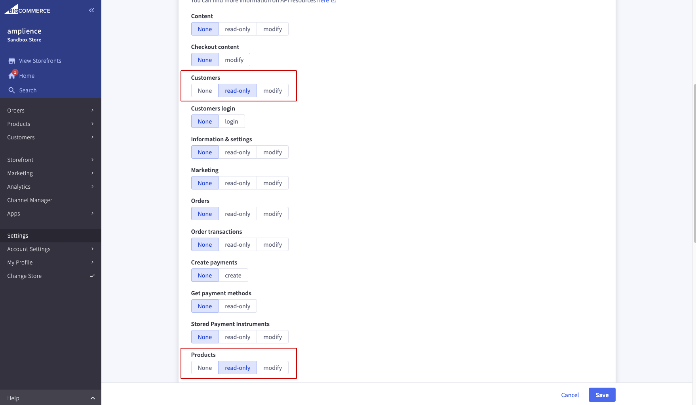
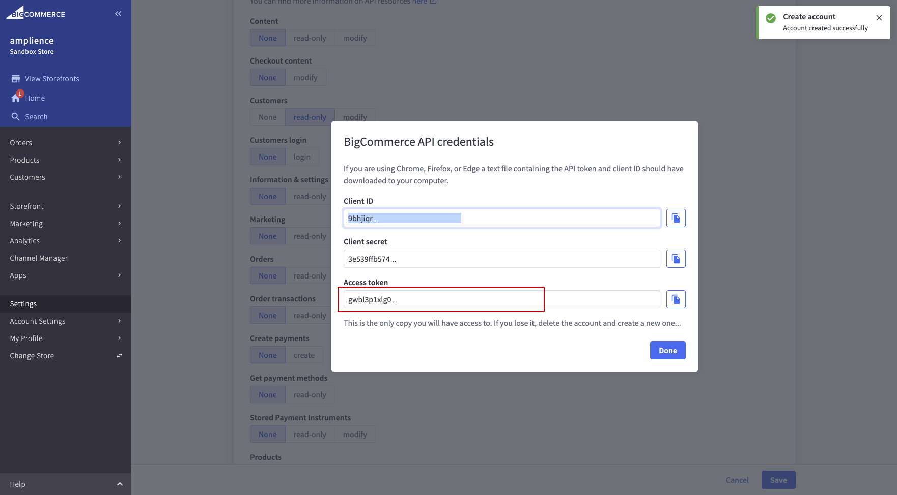

# BigCommerce

## `bigCommerceCodec`
Location: `src/codec/codecs/bigcommerce`

Schema: `https://demostore.amplience.com/site/integration/bigcommerce`

Connects to a BigCommerce instance.

### Configuration

```json
{
    "vendor": "bigcommerce",
    "codec_params": {
        "api_url": "<bigcommerce api url>",
        "api_token": "<bigcommerce api token>",
        "store_hash": "<bigcommerce store hash>"
    }
}
```

## Configuration on the vendor side

### Create Store-level API account

Go to `Settings > Store-level API Tokens` and create API Account.



Select the account type V3 API token.
You can capture the store hash that is part of the API path: `https://api.bigcommerce.com/stores/<store hash>/v3/`



Select the required scopes:
- `Products`
- `Customers`



### Get API credentials

Your credentials can now be accessed (one time), you will need the API URL (`https://api.bigcommerce.com`), the API token and the store hash captured previously.

