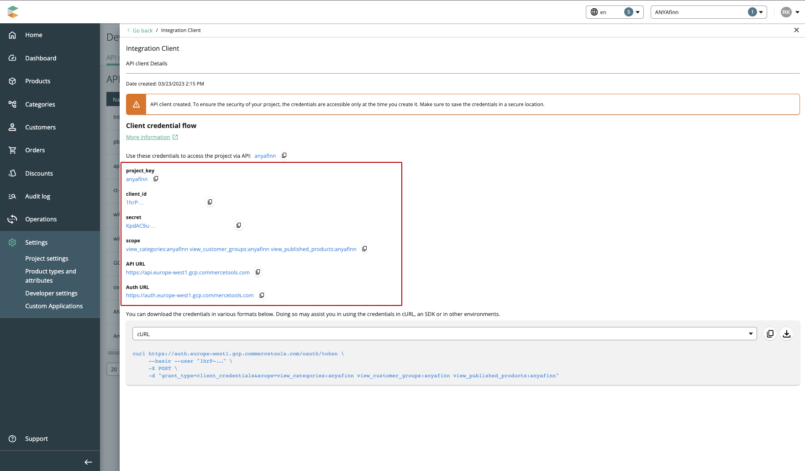

# CommerceTools

## `commerceToolsCodec`
Location: `src/codec/codecs/commercetools`

Schema: `https://demostore.amplience.com/site/integration/commercetools`

Connects to a commercetools instance.

### Configuration

```json
{
    "vendor": "commercetools",
    "codec_params": {
        "project": "<ct project key>",
        "client_id": "<ct client id>",
        "client_secret": "<ct client secret>",
        "auth_url": "<ct auth url",
        "api_url": "<ct api url>",
        "scope": "<list of scopes>"
    }
}
```

## Configuration on the vendor side

You can create new API credentials in the `Settings > Developer settings` and then go to `Create new API client`.


Next you can select the required scopes:

- `Categories`
- `Customer groups`
- `Products (published)`


You can then access the credentials (one time) with all the required properties:


