# Shopify

## `shopifyCodec`

Location: `src/codec/codecs/shopify`

Schema: `https://demostore.amplience.com/site/integration/shopify`

Connects to a Shopify instance.

### Configuration

```json
{
	"vendor": "shopify",
	"codec_params": {
		"access_token": "<storefront access token>",
		"admin_access_token": "<admin access token>",
		"version": "<api version, eg. 2023-01>",
		"site_id": "<shopify site id>"
	}
}
```

## Configuration on the vendor side

The Shopify integration requires both a storefront and an admin token, therefore you'll need to enable custom app development on your store, create a custom app **_and_** install the app in the store to generate those tokens. The steps are as follows

### Enable Custom Apps

In the Settings for your store, click "Apps and sales channels", then click "Develop Apps" (highlighted below)

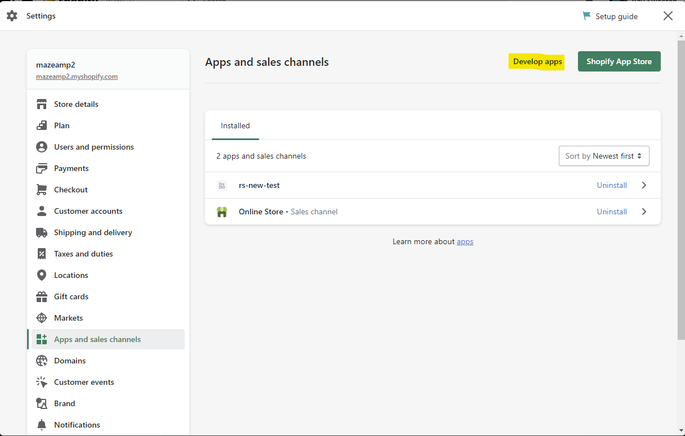

On the next screen, click "Allow custom app development"

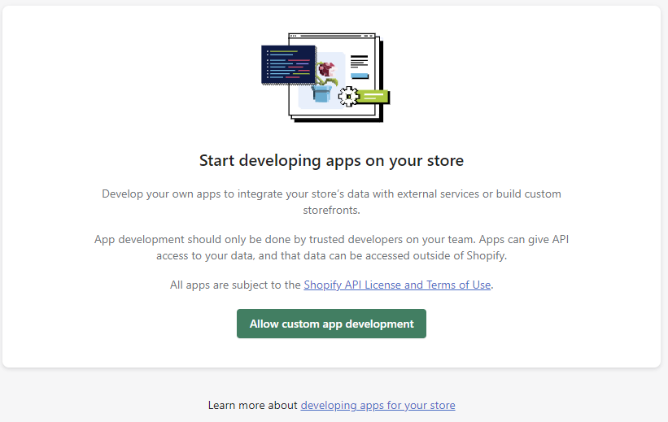

Finally, click "Allow custom app development" in that last screen.

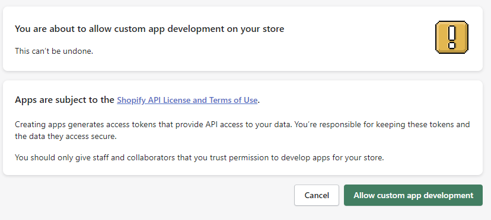

### Create a custom app

once you've done that, you'll be back on the "Apps and sales channels" settings page. Go aheand and click "Create an app"

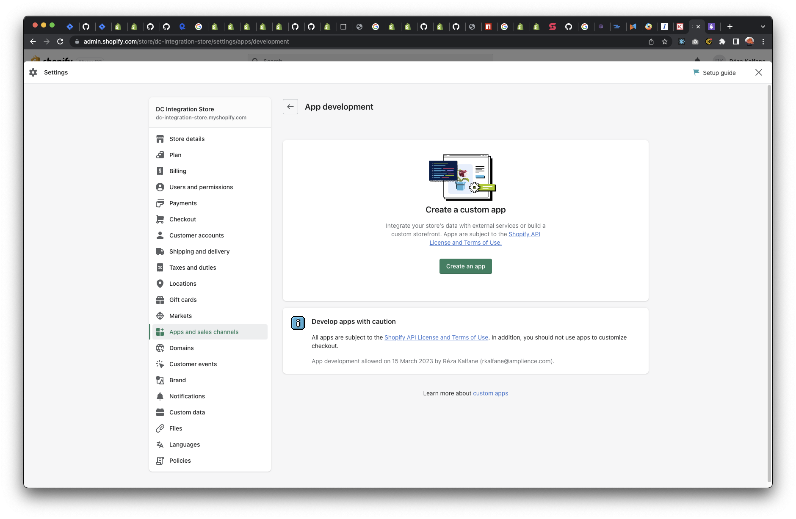

Then give your app a name and assign an App developer.

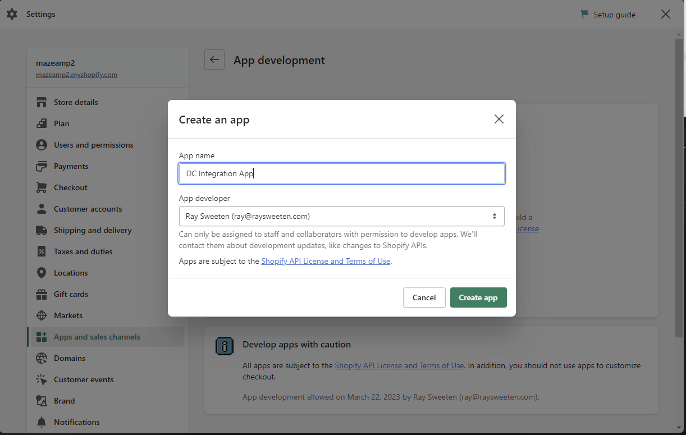

Now that you app has been created, you need to configure BOTH Admin & Storefront API Scopes

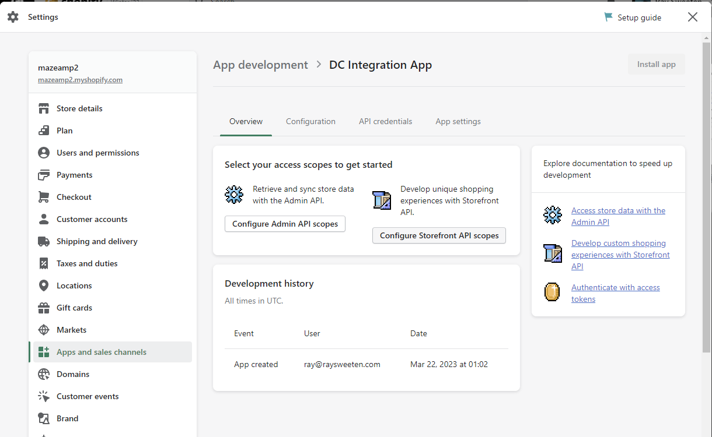

In each of those pages, select everything you want access to in each API. IN the screenshots, we've just selected the read access points, but you may want to add write access should you choose to update or add to any of the shopify methods already provided. More info on that [here](../dev/add-integration.md) and [here](../dev/modify-integration.md)

> Note! The Webhook version highlight in the Admin API integration screenshot is the `version` for your codec config at the top the page.

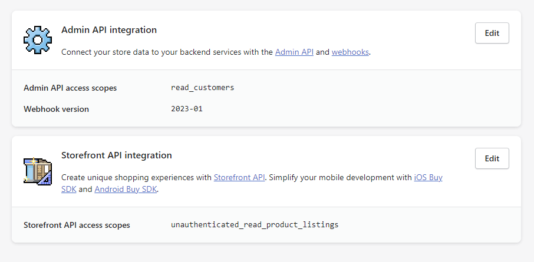
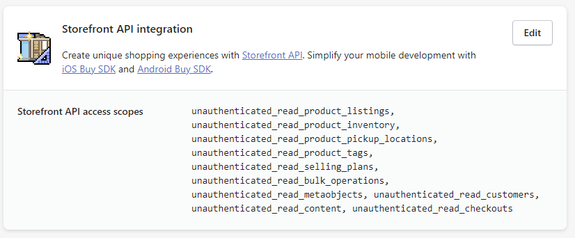

### Get access tokens

At this point, if you go to the API Credentials Tab, you'll see that you already have an API key and secret, however we really need to tokens, so you'll need to install the app..

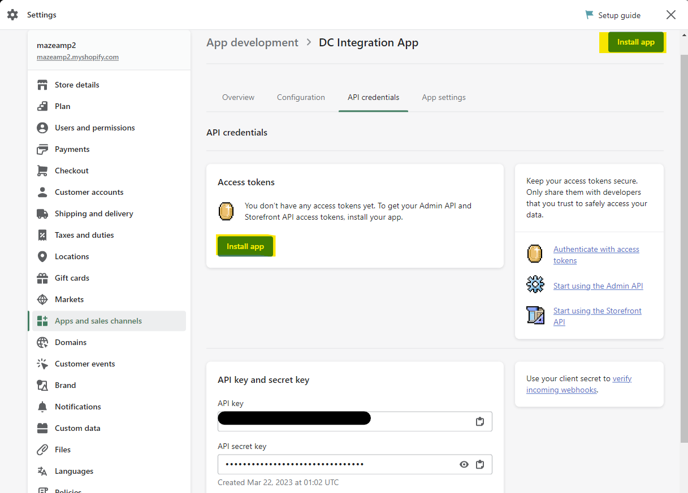

> Note the site/store where you're installing your app (highlighted in the screenshot.. yours will be different), that's your `site_id`.

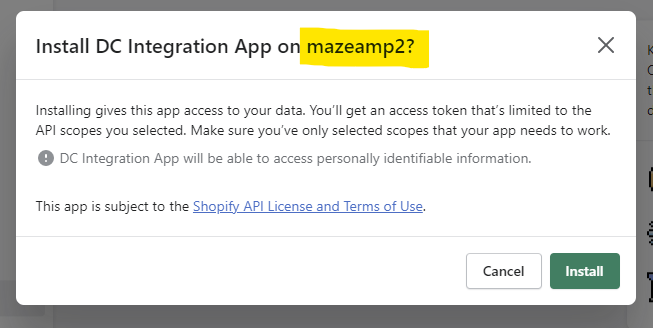

Once you've installed the App you'll see your Admin and Storefront Access Tokens!

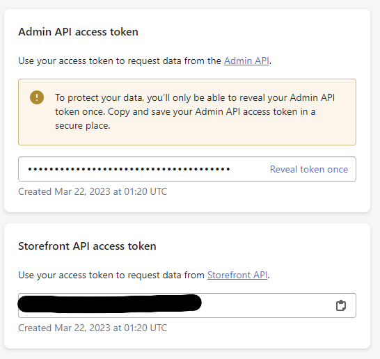
